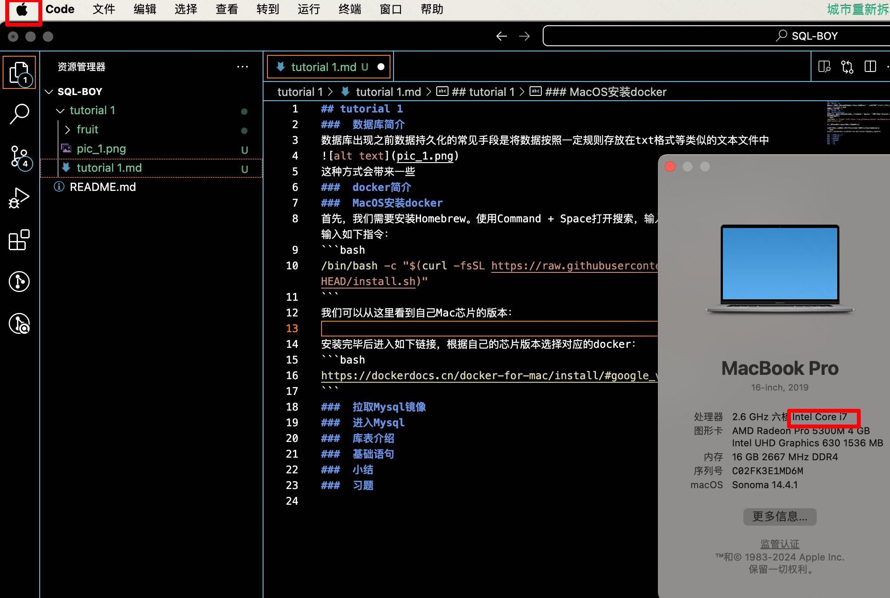
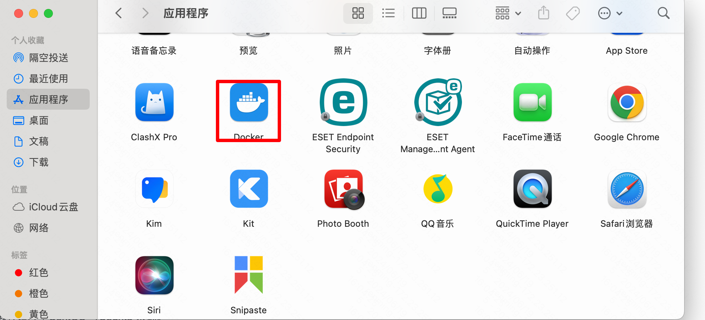

## tutorial 1
###  数据库简介
数据库出现之前数据持久化的常见手段是将数据按照一定规则存放在txt格式等类似的文本文件中

～～
###  docker简介
###  MacOS安装docker
首先，我们需要安装Homebrew。使用Command + Space打开搜索，输入`Terminal`打开终端，然后，输入如下指令：
```bash
/bin/bash -c "$(curl -fsSL https://raw.githubusercontent.com/Homebrew/install/HEAD/install.sh)"
```
我们可以把鼠标移到左上角苹果，点击`关于本机`查看自己Mac芯片的版本，然后在处理器一栏看关键字`Intel`或者`M~`。图中展示的是一台`Intel`芯片的Mac。

安装完毕后进入如下链接，根据自己的芯片版本选择对应的docker搜索并安装Mysql：
```bash
https://dockerdocs.cn/docker-for-mac/install/#google_vignette
```
安装dmg:

###  拉取Mysql镜像
打开docker，搜索并拉取Mysql镜像：


拉取完成后，使用Command + Space打开搜索，输入`Terminal`打开终端，输入下面的指令运行Mysql镜像：
```bash
docker run -itd --name mysql-test -p 3306:3306 -e MYSQL_ROOT_PASSWORD=123456 mysql
```
MYSQL_ROOT_PASSWORD=123456 表示用户 `root` 的密码是 `123456`

###  进入Mysql
###  库表介绍
###  基础语句
###  小结
###  习题
