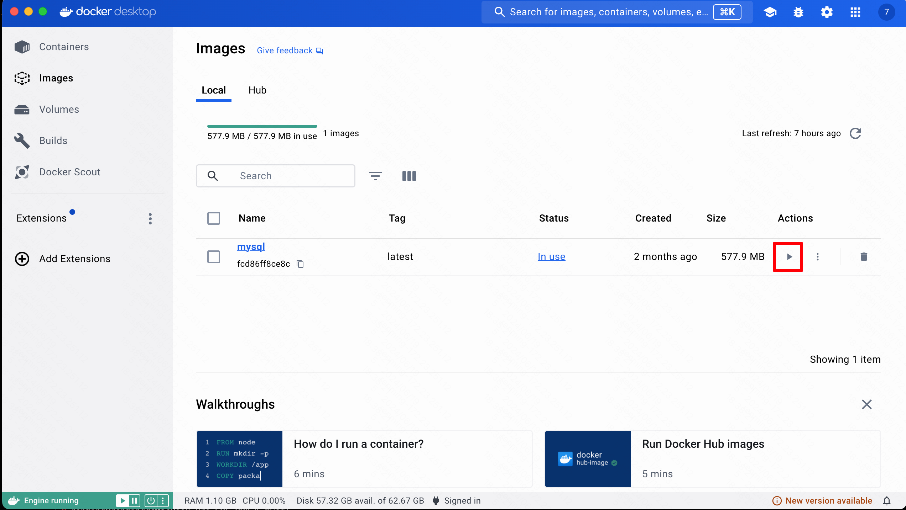
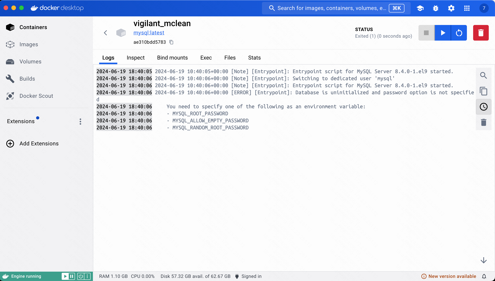

## tutorial 1
###  数据库简介
数据库出现之前数据持久化的常见手段是将数据按照一定规则存放在txt格式等类似的文本文件中

～～
###  docker简介
###  MacOS安装docker
首先，我们需要安装Homebrew。使用Command + Space打开搜索，输入`Terminal`打开终端，然后，输入如下指令进行安装：

```bash
/bin/bash -c "$(curl -fsSL https://raw.githubusercontent.com/Homebrew/install/HEAD/install.sh)"
```

我们可以把鼠标移到左上角苹果，点击`关于本机`查看自己Mac芯片的版本，然后在处理器一栏看关键字`Intel`或者`M~`。图中展示的是一台`Intel`芯片的Mac。


安装完毕后进入如下链接，根据自己的芯片版本选择对应的docker下载并安装：

```bash
https://dockerdocs.cn/docker-for-mac/install/#google_vignette
```

安装docker:


###  拉取Mysql镜像

打开docker，搜索并拉取Mysql镜像：


拉取完成后，使用Command + Space打开搜索，输入`Terminal`打开终端，输入下面的指令查看Mysql镜像是否被成功拉取：

```bash
docker images -a
```

**上述命令中：**

`-a` 表示展示所有容器


###  进入Mysql

点击`run`，就可以在docker中运行Mysql：



如果显示以下信息，则表示docker启动了Mysql：



成功启动Mysql服务后，我们可以使用以下指令查询当前运行中的容器：

```bash
docker ps

or

docker ps -a
```
**上述命令中：**

`docker ps` 表示展示当前运行中的容器

`docker ps -a` 表示展示所有容器


然后执行下面的指令创建一个Mysql示例，并且为这个示例设置账号密码：

```bash
docker run -itd --name mysql-test -p 3306:3306 -e MYSQL_ROOT_PASSWORD=123456 mysql
```

**上述命令中：**

`--name mysql-test` 表示创建实例`mysql-test` 

`-e MYSQL_ROOT_PASSWORD=123456` 表示`root`的密码是`123456`

`-p 3306:3306` 表示`宿主机ip:端口号`为`3306:3306`

`-d mysql` 表示为`mysql`开启一个`守护进程`

###  库表介绍
###  基础语句
###  小结
###  习题
