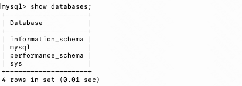
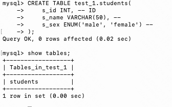

## tutorial 2
### 拥有自己的数据库
上一节我们学会了使用 docker 安装 Mysql，并且学会了一些 Mysql 的基础指令。接下来，我们将创建一个新的数据库，并且在新的数据库中创建几张表，最后进行数据的增删查改。

初始化 Mysql 后，会生成一些基础数据库，这些数据库记录了 Mysql 的使用记录、Mysql 的性能表现、用户信息等信息。



接下来，我们创建一个名为`test_1`的数据库：

```sql
create database test_1;
```


我们发现，Database 在最下面新增了一行`test_1`，这表示我们创建数据库成功。接下来，我们可以试着在`test_1`中新建一张名为`students`的表，不过在此之前，我们有必要了解 Mysql 表中的[数据类型](https://www.runoob.com/mysql/mysql-data-types.html)：

```sql
-- 可以先使用数据库再新建表
use test_1;

CREATE TABLE students(
    s_id INT, -- 学生的ID
    s_name VARCHAR(50), -- 学生的姓名
    s_sex ENUM('male', 'female') -- 学生的性别
);

-- 也可以直接新建表
CREATE TABLE test_1.students(
    s_id INT, -- 学生的ID
    s_name VARCHAR(50), -- 学生的姓名
    s_sex ENUM('male', 'female') -- 学生的性别
);
```



现在，我们成功创建了`students`表，我们可以查询`students`表中的内容，检查一下是否符合预期：

```sql
select * from students;
```


好吧！由于我们并未在表中插入数据，所以我们无法通过熟悉的方式查看表的结构，这真是令人伤心。但是，我们可以先往表中插入一条数据：

```sql
INSERT INTO students (s_id, s_name, s_sex)
VALUES (1, 'Ming', 'male');
```

然后我们再次查询`students`表中的内容：

```sql
select * from students;
```


这下我们不仅能看到表的结构，还能够看到刚才插入的那条数据了。

不过这些特征好像还不能体现`students`的特质，我可不是个随便的人！我们要删掉这张表：

```sql
DROP TABLE students;
```

并且创建一张新的、具有`students`特质的一张表:

```sql
CREATE TABLE students(
    s_id INT, -- 学生的ID
    s_name VARCHAR(50), -- 学生的姓名
    s_sex ENUM('male', 'female'), -- 学生的性别
    s_score FLOAT, -- 学生的分数
    s_phone CHAR(11), -- 学生的电话
    s_birthday DATE -- 学生的生日
);
```

然后更新`Ming`同学的信息：

```sql
INSERT INTO students (s_id, s_name, s_sex, s_score, s_phone, s_birthday)
VALUES (1, 'Ming', 'male', 59.99, 12345678910, '2024-06-24');
```

我们查询更新后`students`表中的内容：

```sql
select * from students;
```


现在`Ming`不及格的事情被大家知道了！